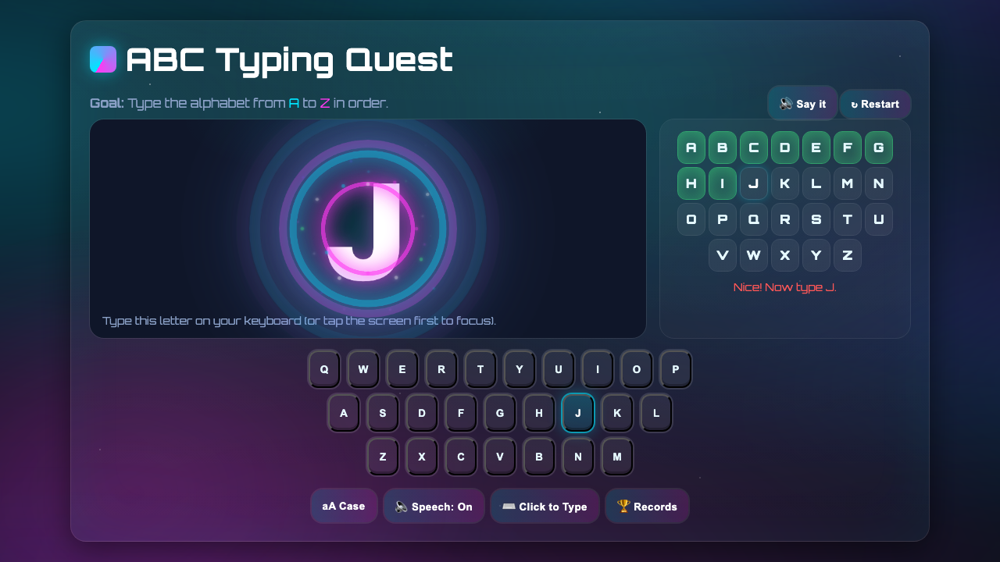

# ABC Typing Quest

Once upon a time, my five-year-old son and I were sitting outside, when he noticed the keys on my laptop's keyboard, and started finding the letters.

I thought to myself, "Oh, it'd be cool to show him a typing game so he could explore the keyboard."

I typed in what I was looking for into ChatGPT.com (because Google has gotten so bad these days), expecting it to find me an existing game, but instead, it just built the app in one go.

Then, my son made his first feature-request: he wanted the game to guide the player through typing the alphabet by displaying the next letter to type.

[Try it out!](https://ethanjstark.github.io/Typing-Game/)

## Features

- **Beautiful Aurora Background**: Dynamic animated aurora borealis effect
- **Visual Feedback**: Pop animations, particle effects, and glowing rings on correct keypresses
- **Audio Feedback**: Speech synthesis reads each letter aloud
- **Progress Tracking**: Visual progress bar showing completed letters
- **Records System**: Track your best times and view leaderboard
- **On-Screen Keyboard**: Touch-friendly keyboard for mobile devices
- **Responsive Design**: Works on desktop and mobile

## How to Play

1. Launch the game [here](https://ethanjstark.github.io/Typing-Game/)
2. Type the letters A through Z in order
3. Watch for the glowing animations and listen to the letter sounds
4. Complete the alphabet as fast as you can to set a new record!

## Controls

- **🔊 Say it**: Hear the target letter spoken
- **↻ Restart**: Start a new round
- **aA Case**: Toggle between uppercase and lowercase display
- **🔈 Speech**: Toggle voice feedback on/off
- **⌨️ Click to Type**: Focus the typing input (useful on mobile)
- **🏆 Records**: View your best times and recent runs

## Technologies

- Pure HTML/CSS/JavaScript (no dependencies)
- CSS animations and keyframes
- Canvas for confetti effects
- Web Speech API for audio feedback
- LocalStorage for saving records
